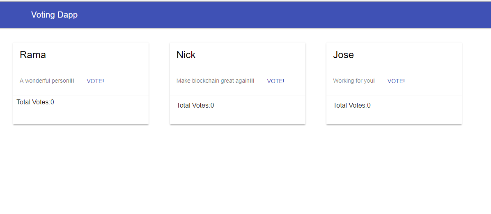

# ethereum-voting-dapp
Hello world for writing Ethereum apps!

This is a pure javascript and material design port of [this awesome tutorial](https://medium.com/@mvmurthy/full-stack-hello-world-voting-ethereum-dapp-tutorial-part-1-40d2d0d807c2) . 

To Use:
- read the [tutorial](https://medium.com/@mvmurthy/full-stack-hello-world-voting-ethereum-dapp-tutorial-part-1-40d2d0d807c2) 
- install and run testrpc : npm install -g ethereumjs-testrpc
- run the scripts in the 'NodeScript' dir
- change line 7 of voting-dap-ui/scripts/app.js to the contractInstance.address 
- serve up the web app (I use [web server for chrome](https://chrome.google.com/webstore/detail/web-server-for-chrome/ofhbbkphhbklhfoeikjpcbhemlocgigb?hl=en)

